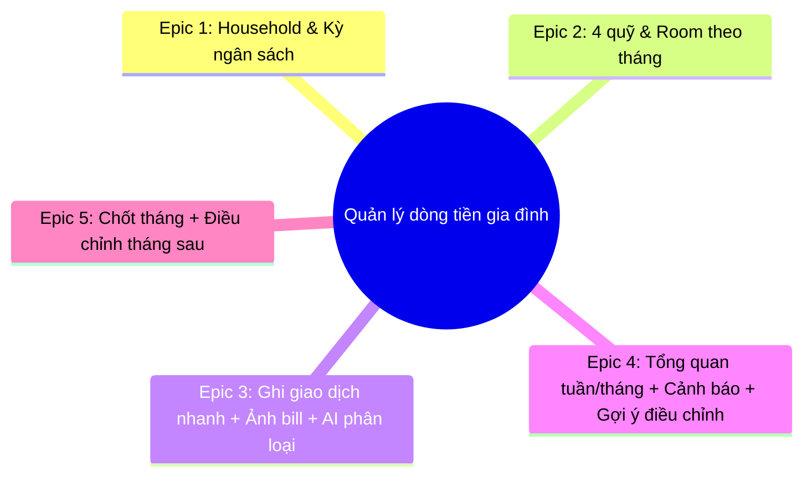

# BỘ ĐẶC TẢ EPIC & USER STORIES — DỰ ÁN QUẢN LÝ DÒNG TIỀN GIA ĐÌNH (MOBILE-FIRST)

> **Dự án:** Quản lý dòng tiền gia đình (Mobile-first) — 4 quỹ + check-in 15 phút/tuần + AI hỗ trợ  
> **Phương pháp quản trị:** Agile / Scrum  
> **Nguồn yêu cầu:** `PRD-QuanLyDongTienGiaDinh.md`  
> **Personas:**
> 1. **Vợ/Chồng A (người theo dõi)**: thích tổng quan nhanh, ra quyết định theo “room”.
> 2. **Vợ/Chồng B (người chi linh hoạt)**: cần ghi nhanh, ít bị “soi”, vẫn thấy giới hạn.
> 3. **Household (ngân sách chung)**: cả hai cùng thấy tất cả giao dịch; mục tiêu là giảm tranh luận và “đỡ hẫy” cuối tháng.

---

## TỔNG QUAN 5 EPICS CỐT LÕI

---

## EPIC 1: HOUSEHOLD & CẤU HÌNH KỲ NGÂN SÁCH

**Mô tả:** Thiết lập ngân sách chung (household) và nhịp vận hành theo tháng (ngày nhận lương, kỳ ngân sách).

### User Stories Chi Tiết:

#### US-1.1: Tạo household
- **User Story:** Là một *Vợ/Chồng*, tôi muốn *tạo household (ngân sách chung)*, để *bắt đầu quản lý chi tiêu cùng nhau*.
- **Độ ưu tiên:** P0 (Must have) | **Story Points:** 3
- **Scope (In/Out):**
  - In: tạo household + set currency mặc định VND.
  - Out: đổi tiền tệ đa quốc gia; nhiều household/1 user (v2).
- **Preconditions:**
  - Người dùng đã đăng nhập.
- **UX/Flow:**
  - Trang “Tạo household” → nhập tên → tạo → chuyển sang dashboard rỗng.
- **Acceptance Criteria (Given/When/Then):**
  - [x] Given user đã đăng nhập, When tạo household với tên hợp lệ, Then household được tạo thành công với currency = VND.
  - [x] Given household vừa tạo, When mở household, Then người tạo được gán vai trò quản trị.
  - [x] Given household chưa có dữ liệu, When vào dashboard, Then hiển thị empty-state + CTA cấu hình ngân sách tháng.
- **Test Cases (QA-ready):**
  - [x] Tạo household với tên “Nhà A” → tạo thành công, vào dashboard.
  - [x] Nhập tên rỗng / toàn khoảng trắng → báo lỗi validation, không tạo.
  - [x] Tạo household xong refresh trang → household vẫn tồn tại, session vẫn vào đúng household.
- **Telemetry:**
  - `household_created`
- **Definition of Done (DoD):**
  - Dev: endpoint/create + lưu DB + validation + unit test validation.
  - QA: chạy test cases trên Chrome mobile + desktop.

#### US-1.2: Mời thành viên còn lại vào household
- **User Story:** Là một *Quản trị household*, tôi muốn *mời vợ/chồng qua email hoặc link*, để *cả hai cùng xem và ghi giao dịch*.
- **Độ ưu tiên:** P0 (Must have) | **Story Points:** 5
- **Scope (In/Out):**
  - In: tạo invite link/token có thời hạn + accept invite.
  - Out: RBAC phức tạp, phân quyền theo dữ liệu (không có private mode trong MVP).
- **Preconditions:**
  - Household đã tồn tại.
  - Người mời là quản trị household.
- **UX/Flow:**
  - Settings → Members → Generate invite link → share → người nhận mở link → Join.
- **Acceptance Criteria (Given/When/Then):**
  - [x] Given quản trị tạo invite, When generate link, Then có link/token + expiry hiển thị.
  - [x] Given người nhận mở link hợp lệ, When bấm Join, Then trở thành member của household.
  - [x] Given member mới đã join, When vào dashboard, Then xem được tất cả giao dịch/budget của household.
  - [x] Given link hết hạn/invalid, When mở link, Then bị chặn và có hướng dẫn xin link mới.
- **Test Cases (QA-ready):**
  - [x] Generate link → mở link trên trình duyệt ẩn danh → Join thành công.
  - [x] Dùng lại link sau khi bị revoke/hết hạn → fail đúng thông báo.
  - [x] Người không phải admin cố generate invite → bị chặn (403/UI disabled).
- **Telemetry:**
  - `invite_created`, `invite_accepted`, `invite_failed`
- **DoD:**
  - Dev: token store + expiry + revoke + audit đơn giản.
  - QA: test join trên 2 thiết bị/2 browser profile.

#### US-1.3: Thiết lập ngày nhận lương & tháng ngân sách
- **User Story:** Là một *Household*, tôi muốn *thiết lập ngày nhận lương và kỳ ngân sách theo tháng*, để *vận hành theo nhịp “trích quỹ trước khi tiêu”*.
- **Độ ưu tiên:** P1 (Should have) | **Story Points:** 3
- **Scope (In/Out):**
  - In: cấu hình payday day-of-month (1–28) + hiển thị kỳ hiện tại.
  - Out: nhiều kỳ ngân sách khác tháng (tuần/quý) (v2).
- **Preconditions:**
  - Household đã tạo.
- **UX/Flow:**
  - Settings → Budget Cycle → chọn payday → Save.
- **Acceptance Criteria (Given/When/Then):**
  - [x] Given user mở settings, When chọn payday trong [1..28] và save, Then payday được lưu cho household.
  - [x] Given payday thay đổi, When chọn “áp dụng từ kỳ sau”, Then kỳ hiện tại không bị chỉnh retro.
  - [x] Given đang ở dashboard, When xem header tháng, Then thấy rõ tháng/năm và trạng thái (open/closed).
- **Test Cases (QA-ready):**
  - [x] Save payday = 25 → reload → vẫn là 25.
  - [x] Try set payday = 0 hoặc 31 → validation fail.
- **Telemetry:**
  - `budget_cycle_updated`
- **DoD:**
  - Dev: migrate field + API + UI.
  - QA: verify trên desktop/mobile.

---

## EPIC 2: 4 QUỸ NGÂN SÁCH & “ROOM” CÒN LẠI

**Mô tả:** Thiết lập 4 quỹ mặc định, cấu hình ngân sách theo tháng, và hiển thị “room” còn lại theo quỹ.

### User Stories Chi Tiết:

#### US-2.1: Cấu hình ngân sách tháng theo 4 quỹ (tỷ lệ hoặc số tiền)
- **User Story:** Là một *Household*, tôi muốn *đặt ngân sách cho 4 quỹ theo tháng*, để *biết giới hạn chi và mục tiêu tiết kiệm*.
- **Độ ưu tiên:** P0 (Must have) | **Story Points:** 8
- **Scope (In/Out):**
  - In: cấu hình budget theo month cho 4 quỹ; 2 mode: số tiền / tỷ lệ.
  - Out: ngân sách theo danh mục con (ăn uống/mua sắm) (v2).
- **Preconditions:**
  - Household tồn tại.
- **UX/Flow:**
  - Onboarding / Settings → Budgets → chọn mode → nhập số → Save → xem room trên dashboard.
- **Acceptance Criteria (Given/When/Then):**
  - [x] Given budget mode = amount, When nhập budget cho 4 quỹ và save, Then budgets lưu cho tháng.
  - [x] Given budget mode = percent, When nhập % cho 4 quỹ và tổng != 100, Then chặn save + hiển thị lỗi.
  - [x] Given budgets đã lưu, When mở dashboard tháng, Then hiển thị budget/spent/room theo từng quỹ.
- **Test Cases (QA-ready):**
  - [x] Amount mode: set 4 quỹ → save → dashboard hiển thị đúng.
  - [x] Percent mode: tổng 90% → không save; tổng 100% → save ok.
  - [x] Nhập số âm / ký tự → validation fail.
- **Telemetry:**
  - `monthly_budget_saved`, `monthly_budget_save_failed`
- **DoD:**
  - Dev: data model `BudgetPeriod` + calc room.
  - QA: verify room = budget - spent với data mẫu.

#### US-2.2: “Trích quỹ trước” trong ngày nhận lương
- **User Story:** Là một *Household*, tôi muốn *có thao tác “trích quỹ” trong ngày nhận lương*, để *chốt trước các quỹ rồi mới chi linh hoạt*.
- **Độ ưu tiên:** P1 (Should have) | **Story Points:** 5
- **Scope (In/Out):**
  - In: wizard hỗ trợ set budgets dựa trên payday.
  - Out: tự động nhắc lịch/notification (v2).
- **Preconditions:**
  - Payday đã set (US-1.3) hoặc user chọn ngày thủ công trong wizard.
- **UX/Flow:**
  - CTA “Trích quỹ tháng này” → wizard → confirm → budgets được tạo/cập nhật.
- **Acceptance Criteria (Given/When/Then):**
  - [x] Given user mở wizard, When nhập tổng thu (optional) và xác nhận, Then budgets tạo theo mode đã chọn.
  - [x] Given user bỏ qua tổng thu, When nhập budgets theo số tiền, Then vẫn confirm được.
  - [x] Given confirm thành công, When quay về dashboard, Then room cập nhật ngay.
- **Test Cases (QA-ready):**
  - [x] Wizard với tổng thu + % → budgets ra số tiền đúng.
  - [x] Wizard bỏ qua tổng thu → nhập số tiền trực tiếp → save ok.
- **Telemetry:**
  - `funds_allocated`
- **DoD:**
  - Dev: calc + save atomic; no partial write.
  - QA: verify rollback nếu lỗi.

---

## EPIC 3: GHI GIAO DỊCH NHANH + ẢNH BILL + AI PHÂN LOẠI

**Mô tả:** Thu thập chi tiêu cực nhanh; ảnh bill hỗ trợ đối chiếu; AI gợi ý phân loại để giảm công sức.

### User Stories Chi Tiết:

#### US-3.1: Thêm giao dịch chi tiêu nhanh
- **User Story:** Là một *Thành viên household*, tôi muốn *thêm giao dịch trong <30 giây*, để *không ngại ghi chép*.
- **Độ ưu tiên:** P0 (Must have) | **Story Points:** 5
- **Scope (In/Out):**
  - In: tạo transaction manual; default quỹ theo lần chọn gần nhất hoặc AI gợi ý (nếu có).
  - Out: import bank statements (v2).
- **Preconditions:**
  - Household đã join.
  - Tháng hiện tại có budgets (khuyến nghị; nếu chưa có thì vẫn cho tạo giao dịch và cảnh báo “chưa set budget”).
- **UX/Flow:**
  - Mobile-first quick-add: amount (required), date (default today), fund (default), note (optional).
- **Acceptance Criteria (Given/When/Then):**
  - [x] Given user ở dashboard, When nhập amount hợp lệ và save, Then giao dịch được tạo thành công.
  - [x] Given giao dịch tạo thành công, When quay về dashboard, Then spent/room của quỹ tương ứng cập nhật.
  - [x] Given amount invalid (rỗng/0/âm), When save, Then bị chặn + lỗi rõ.
- **Test Cases (QA-ready):**
  - [x] Create transaction 120k → fund Gia đình & Con → spent tăng đúng.
  - [x] Create transaction với date tháng trước → vẫn lưu đúng kỳ và phản ánh đúng tháng.
  - [x] Double submit (bấm save 2 lần) → không tạo duplicate (idempotency UI).
- **Telemetry:**
  - `transaction_created`, `transaction_create_failed`
- **DoD:**
  - Dev: server-side validation + unit tests.
  - QA: verify trên mobile web (touch).

#### US-3.2: Đính kèm ảnh bill cho giao dịch
- **User Story:** Là một *Thành viên household*, tôi muốn *đính kèm ảnh bill*, để *dễ nhớ và đối chiếu*.
- **Độ ưu tiên:** P1 (Should have) | **Story Points:** 3
- **Scope (In/Out):**
  - In: upload ảnh (jpg/png) + preview.
  - Out: OCR bắt buộc từ ảnh (được dùng ở US-3.4).
- **Preconditions:**
  - Giao dịch đã tồn tại.
- **UX/Flow:**
  - Transaction detail → Add receipt → upload → preview.
- **Acceptance Criteria (Given/When/Then):**
  - [x] Given transaction tồn tại, When upload ảnh hợp lệ, Then ảnh được gắn vào transaction.
  - [x] Given ảnh đã gắn, When xem list/detail, Then thấy thumbnail + xem full.
  - [x] Given upload lỗi, When retry/cancel, Then transaction vẫn giữ nguyên; UI báo lỗi.
- **Test Cases (QA-ready):**
  - [x] Upload PNG 2MB → success.
  - [x] Upload file không phải ảnh → reject.
  - [x] Mất mạng giữa chừng → upload fail, có retry.
- **Telemetry:**
  - `receipt_uploaded`, `receipt_upload_failed`
- **DoD:**
  - Dev: limit size/type + signed URL/storage.
  - QA: verify preview + error states.

#### US-3.3: Sửa/xoá giao dịch + dấu vết thay đổi
- **User Story:** Là một *Household*, tôi muốn *sửa/xoá giao dịch và biết ai đã sửa*, để *minh bạch trong ngân sách chung*.
- **Độ ưu tiên:** P1 (Should have) | **Story Points:** 5
- **Scope (In/Out):**
  - In: edit fields (amount/date/fund/note) + soft delete.
  - Out: full audit trail chuẩn kế toán (v2).
- **Preconditions:**
  - Transaction tồn tại.
- **UX/Flow:**
  - Transaction detail → Edit → Save; Delete → Confirm.
- **Acceptance Criteria (Given/When/Then):**
  - [x] Given user là member household, When edit transaction và save, Then transaction cập nhật và lưu updatedBy/updatedAt.
  - [x] Given user là member household, When delete và confirm, Then transaction chuyển trạng thái deleted (không xoá cứng).
  - [x] Given transaction bị delete, When xem dashboard, Then spent/room được trừ lại đúng.
- **Test Cases (QA-ready):**
  - [x] Edit fund từ Gia đình & Con → Cố định: spent chuyển quỹ đúng.
  - [x] Delete transaction: spent giảm đúng; list ẩn item (hoặc có filter “đã xoá”).
  - [x] User không thuộc household: không truy cập được transaction (403).
- **Telemetry:**
  - `transaction_updated`, `transaction_deleted`
- **DoD:**
  - Dev: soft delete + recalculation.
  - QA: regression spent/room.

#### US-3.4: AI gợi ý phân loại quỹ từ mô tả/ảnh bill
- **User Story:** Là một *Thành viên household*, tôi muốn *AI gợi ý quỹ phù hợp và mức tin cậy*, để *phân loại nhanh nhưng vẫn kiểm soát được*.
- **Độ ưu tiên:** P1 (Should have) | **Story Points:** 8
- **Scope (In/Out):**
  - In: classify fund suggestion + confidence; learn from corrections (household-level mapping).
  - Out: tự động phân rã danh mục con chi tiết (v2).
- **Preconditions:**
  - Có text mô tả hoặc ảnh bill (optional).
- **UX/Flow:**
  - Quick-add/Edit: hiển thị “Suggested fund” + confidence; 1-click accept; dropdown override.
- **Acceptance Criteria (Given/When/Then):**
  - [x] Given user nhập mô tả/đính kèm bill, When hệ thống gọi AI, Then trả về fund suggestion + confidence.
  - [x] Given user override fund, When save, Then lưu correction để tăng độ đúng lần sau (household-level).
  - [x] Given AI lỗi/offline, When tạo giao dịch, Then vẫn tạo được và không chặn luồng.
- **Test Cases (QA-ready):**
  - [x] Với mô tả “điện nước”, AI gợi ý Cố định (hoặc confidence thấp nếu không chắc).
  - [x] Override từ Cố định → Gia đình & Con: lần sau cùng keyword gợi ý đúng (rule/learning).
  - [x] Simulate AI down: UI không treo; cho chọn quỹ thủ công.
- **Telemetry:**
  - `ai_classify_suggested`, `ai_classify_accepted`, `ai_classify_overridden`, `ai_classify_failed`
- **DoD:**
  - Dev: timeout + retries + graceful fallback.
  - QA: test AI down + slow network.

---

## EPIC 4: TỔNG QUAN TUẦN/THÁNG + CẢNH BÁO + GỢI Ý ĐIỀU CHỈNH

**Mô tả:** Đưa ra bức tranh theo tuần để ra quyết định; cảnh báo sớm theo nhịp chi; gợi ý điều chỉnh “ít đau nhất”.

### User Stories Chi Tiết:

#### US-4.1: Dashboard tháng theo 4 quỹ
- **User Story:** Là một *Household*, tôi muốn *xem dashboard tháng (spent/room theo quỹ)*, để *biết đang trong giới hạn hay không*.
- **Độ ưu tiên:** P0 (Must have) | **Story Points:** 5
- **Scope (In/Out):**
  - In: dashboard month-level theo quỹ.
  - Out: drill-down theo danh mục con (v2).
- **Preconditions:**
  - Có budgets hoặc giao dịch; nếu chưa có thì show empty-state phù hợp.
- **UX/Flow:**
  - Dashboard → Month selector → cards/quỹ.
- **Acceptance Criteria (Given/When/Then):**
  - [x] Given budgets tồn tại, When mở dashboard tháng, Then hiển thị budget/spent/room/% used của 4 quỹ.
  - [x] Given room dưới ngưỡng, When hiển thị card, Then có trạng thái cảnh báo; khi vượt thì đỏ.
  - [x] Given đổi tháng, When select tháng khác, Then số liệu đổi đúng.
- **Test Cases (QA-ready):**
  - [x] Tháng có 5 giao dịch → spent = tổng giao dịch theo quỹ.
  - [x] Tháng không có budget nhưng có giao dịch → hiển thị spent, room = “N/A” + CTA set budget.
  - [x] Tháng khác không có data → empty-state.
- **Telemetry:**
  - `dashboard_month_viewed`
- **DoD:**
  - Dev: query aggregation + caching basic.
  - QA: verify totals.

#### US-4.2: Weekly check-in (15 phút) với tóm tắt tuần
- **User Story:** Là một *Household*, tôi muốn *trang check-in tuần tổng hợp dễ hiểu*, để *ra quyết định điều chỉnh sớm*.
- **Độ ưu tiên:** P0 (Must have) | **Story Points:** 8
- **Scope (In/Out):**
  - In: weekly summary + confirm check-in.
  - Out: lịch nhắc tự động (v2).
- **Preconditions:**
  - Có giao dịch trong tuần (không có thì show empty-state “tuần này chưa ghi”).
- **UX/Flow:**
  - Dashboard → Weekly Check-in → xem summary → Confirm.
- **Acceptance Criteria (Given/When/Then):**
  - [x] Given tuần có giao dịch, When mở weekly check-in, Then hiển thị top 5 + khoản lớn + bất thường + quỹ tăng.
  - [x] Given có tuần trước, When xem compare, Then hiển thị chênh lệch tổng chi và theo quỹ.
  - [x] Given user bấm Confirm, When confirm thành công, Then lưu trạng thái check-in của tuần.
- **Test Cases (QA-ready):**
  - [x] Tuần có 10 giao dịch → top 5 đúng theo amount.
  - [x] Tuần đầu tiên (không có tuần trước) → compare state hợp lý.
  - [x] Confirm 2 lần → lần 2 không tạo duplicate (idempotent).
- **Telemetry:**
  - `weekly_summary_viewed`, `weekly_checkin_confirmed`
- **DoD:**
  - Dev: weekly grouping logic + stable week boundaries (Mon–Sun).
  - QA: verify boundaries theo timezone.

#### US-4.3: Cảnh báo sớm & dự đoán vượt cuối tháng
- **User Story:** Là một *Household*, tôi muốn *nhận cảnh báo khi nhịp chi hiện tại dự đoán sẽ vượt quỹ*, để *điều chỉnh kịp thời*.
- **Độ ưu tiên:** P1 (Should have) | **Story Points:** 8
- **Scope (In/Out):**
  - In: EOM forecast + alert UI.
  - Out: mô hình dự báo phức tạp (v2).
- **Preconditions:**
  - Có budget tháng + có giao dịch (ít nhất vài ngày) để dự báo.
- **UX/Flow:**
  - Dashboard card/quỹ → hiển thị forecast; Alerts panel.
- **Acceptance Criteria (Given/When/Then):**
  - [x] Given có budget + dữ liệu chi, When tính forecast, Then hiển thị EOM dự kiến theo quỹ.
  - [x] Given EOM > budget, When hiển thị, Then có alert trạng thái + giải thích ngắn.
  - [x] Given room dưới ngưỡng, When hiển thị, Then có cảnh báo sớm.
- **Test Cases (QA-ready):**
  - [x] Với nhịp chi đều, forecast = avg daily * days in month (mô tả rõ công thức).
  - [x] Budget = 1,000,000; EOM = 1,200,000 → alert active.
  - [x] Không đủ data (mới 1 giao dịch) → hiển thị “forecast chưa đủ tin cậy”.
- **Telemetry:**
  - `forecast_calculated`, `alert_shown`
- **DoD:**
  - Dev: deterministic forecast formula v1 + unit tests.
  - QA: verify edge cases.

#### US-4.4: Gợi ý điều chỉnh “ít đau nhất” (2–3 phương án)
- **User Story:** Là một *Household*, tôi muốn *được gợi ý 2–3 phương án điều chỉnh*, để *vẫn đạt mục tiêu mà ít ảnh hưởng nhất*.
- **Độ ưu tiên:** P1 (Should have) | **Story Points:** 8
- **Scope (In/Out):**
  - In: suggestion list + impact estimate + record decision.
  - Out: auto-enforcement (tự chặn chi) (không làm).
- **Preconditions:**
  - Có alert/forecast vượt.
- **UX/Flow:**
  - Alert → “Xem gợi ý” → chọn 1 phương án → lưu quyết định.
- **Acceptance Criteria (Given/When/Then):**
  - [x] Given có alert vượt, When mở suggestions, Then thấy 2–3 phương án + mô tả + impact estimate.
  - [x] Given user chọn phương án, When confirm, Then lưu decision + timestamp + optional note.
  - [x] Given đã lưu decision, When quay lại alert, Then hiển thị “đã chọn phương án X”.
- **Test Cases (QA-ready):**
  - [x] Suggestions hiển thị đúng 2–3 items, không rỗng.
  - [x] Chọn phương án → lưu và hiển thị lại sau refresh.
  - [x] AI down → fallback vẫn có gợi ý rule-based (hoặc hiển thị “chưa có gợi ý” nhưng không crash).
- **Telemetry:**
  - `adjustment_suggested`, `adjustment_selected`
- **DoD:**
  - Dev: store decision; no auto mutation.
  - QA: verify persistence.

---

## EPIC 5: CHỐT THÁNG & ĐIỀU CHỈNH THÁNG SAU

**Mô tả:** Chốt tháng bằng 1 trang tổng kết; dùng dữ liệu tháng này để điều chỉnh cấu hình tháng sau.

### User Stories Chi Tiết:

#### US-5.1: Trang chốt tháng (1 trang)
- **User Story:** Là một *Household*, tôi muốn *chốt tháng bằng một trang tổng kết*, để *nhìn lại và rút kinh nghiệm nhanh*.
- **Độ ưu tiên:** P0 (Must have) | **Story Points:** 5
- **Scope (In/Out):**
  - In: monthly close summary.
  - Out: khóa sổ kế toán chuẩn (v2).
- **Preconditions:**
  - Tháng có dữ liệu (hoặc empty-state vẫn cho chốt).
- **UX/Flow:**
  - Dashboard → Close month → xem summary → Confirm close.
- **Acceptance Criteria (Given/When/Then):**
  - [x] Given tháng có dữ liệu, When mở close page, Then thấy tổng chi theo quỹ + vượt/thiếu + top khoản chi.
  - [x] Given tháng có alerts, When mở close page, Then list các alerts đã xảy ra.
  - [x] Given user confirm close, When đóng tháng, Then kỳ tháng chuyển trạng thái closed.
- **Test Cases (QA-ready):**
  - [x] Tháng có data: summary totals đúng.
  - [x] Close tháng 2 lần → lần 2 bị chặn hoặc no-op, không tạo duplicate close.
  - [x] Close xong → không cho edit budgets của tháng đã close (hoặc có cảnh báo).
- **Telemetry:**
  - `month_closed`
- **DoD:**
  - Dev: state transition + guardrails.
  - QA: verify edit restrictions.

#### US-5.2: Điều chỉnh tỷ lệ/số tiền quỹ cho tháng sau
- **User Story:** Là một *Household*, tôi muốn *điều chỉnh cấu hình quỹ cho tháng sau ngay khi chốt*, để *cải thiện theo thực tế*.
- **Độ ưu tiên:** P0 (Must have) | **Story Points:** 5
- **Scope (In/Out):**
  - In: next-month budgets update + history.
  - Out: “what-if simulation” (v2).
- **Preconditions:**
  - Tháng hiện tại đã close hoặc user đang set budgets cho tháng kế tiếp.
- **UX/Flow:**
  - Close page → “Điều chỉnh tháng sau” → edit budgets → Save.
- **Acceptance Criteria (Given/When/Then):**
  - [x] Given user ở close page, When mở form tháng sau, Then load budgets mặc định (copy từ tháng trước hoặc theo cấu hình).
  - [x] Given user save budgets, When save thành công, Then lưu history (ai/when/what).
  - [x] Given tháng sau mở dashboard, When xem budgets, Then phản ánh cấu hình mới.
- **Test Cases (QA-ready):**
  - [x] Edit budgets tháng sau → save → dashboard tháng sau đúng.
  - [x] View history: thấy user + timestamp + diff.
- **Telemetry:**
  - `next_month_budget_updated`
- **DoD:**
  - Dev: history table/field + diff compute.
  - QA: verify history accuracy.

---

## BẢNG MA TRẬN PHÂN BỔ STORY POINTS & ƯU TIÊN SPRINT (ĐỀ XUẤT)

| STT | Epic Name | Số User Stories | Tổng Story Points | Mức Ưu Tiên |
| :---: | :--- | :---: | :---: | :---: |
| **Epic 1** | Household & Kỳ ngân sách | 3 US | 11 SP | **P0/P1 (Nền tảng)** |
| **Epic 2** | 4 quỹ & Room theo tháng | 2 US | 13 SP | **P0 (Cốt lõi)** |
| **Epic 3** | Giao dịch + Bill + AI phân loại | 4 US | 21 SP | **P0/P1 (Cốt lõi)** |
| **Epic 4** | Tổng quan + Cảnh báo + Gợi ý | 4 US | 29 SP | **P0/P1 (Giá trị)** |
| **Epic 5** | Chốt tháng & Điều chỉnh | 2 US | 10 SP | **P0 (Cốt lõi)** |
| **TỔNG** | **5 EPICS** | **15 US** | **84 SP** | **MVP đề xuất ~2–4 sprint tuỳ team** |

---

## (TÙY CHỌN) EPIC 6: GÓI DỊCH VỤ (FREE/PLUS/PRO) & AI AGENTS

**Mô tả:** Bổ sung cơ chế gói dịch vụ để mở khóa tính năng nâng cao và AI agents “thông minh hơn” (không chặn core loop của Free).

> Epic này nên làm sau khi MVP core loop (Epic 1–5) ổn định.

### User Stories Chi Tiết:

#### US-6.1: Quản lý gói dịch vụ (Subscription state)
- **User Story:** Là một *Household*, tôi muốn *thấy trạng thái gói (Free/Plus/Pro) và ngày hết hạn (nếu có)*, để *biết mình đang dùng được gì*.
- **Độ ưu tiên:** P2 (Nice to have) | **Story Points:** 3
- **Scope (In/Out):**
  - In: hiển thị plan + gating UI theo plan.
  - Out: thanh toán thực tế (Stripe/MoMo) (có thể làm sau).
- **Preconditions:** Household tồn tại.
- **Acceptance Criteria:**
  - [x] Hiển thị plan hiện tại ở Settings.
  - [x] Các tính năng Pro hiển thị lock badge khi chưa có plan.
  - [x] Nâng plan (mock flag) mở khóa tính năng ngay.

#### US-6.2: Gate AI quota theo gói
- **User Story:** Là một *Household*, tôi muốn *AI có quota theo gói*, để *Free vẫn dùng được cơ bản nhưng Plus/Pro “mượt” hơn*.
- **Độ ưu tiên:** P2 (Nice to have) | **Story Points:** 5
- **Acceptance Criteria:**
  - [x] Free: quota thấp (ví dụ số lần classify/tuần) + thông báo khi hết.
  - [x] Plus/Pro: quota cao hơn; khi hết quota, fallback manual.
  - [x] Không bao giờ chặn tạo giao dịch vì hết quota.

#### US-6.3: Agent “Budget Coach” (Pro)
- **User Story:** Là một *Household (Pro)*, tôi muốn *agent đề xuất 2–3 phương án điều chỉnh “ít đau nhất” với trade-off rõ*, để *đạt mục tiêu mà ít mệt*.
- **Độ ưu tiên:** P2 (Nice to have) | **Story Points:** 8
- **Acceptance Criteria:**
  - [x] Khi có alert vượt, agent trả 2–3 phương án + impact estimate + trade-off.
  - [x] Có nút “Apply as decision” để lưu lựa chọn (không auto sửa dữ liệu quá khứ).
  - [x] Nếu agent lỗi → fallback suggestions cơ bản (US-4.4).
